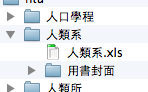
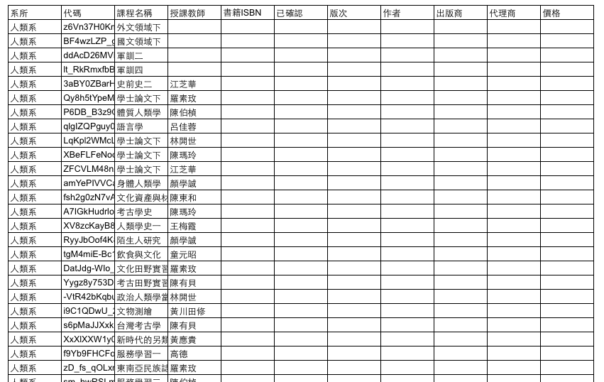
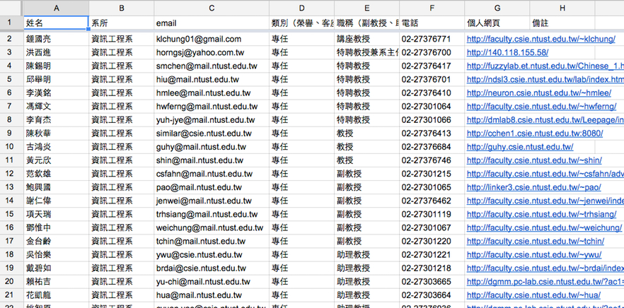

Colorgy Data
============

由三大部分組成，課程資料、教授資料、書資料。

# 系所資料
各系需要提供各系 *學號規則*、系所英文名稱、系所英文縮寫、系所中文縮寫等。

## 學號規則
將會用於 Colorgy 系統註冊時的 *學號辨識*。

------------------------------

# 課程資料
收集方式為 *程式爬蟲*，*課程用書*欄位資料需要系會協助人工完成。

系會將該系課程之用書資料整理為表格，欄位如下：

```
課程序號（課程代碼）、課程名稱，書籍 ISBN，書名、版次、書籍封面、已確認（是/否）
```

## 課程序號
也可能是課程代碼，每堂課唯一的編碼，統一由 MISK 方指派。

## 書籍 ISBN（必填）
填 10 碼或 13 碼皆可。格式統一整齊。

## 書籍封面
供 MISK 核對資料正確性，照片或圖片需命名為 isbn ，例如 xxxx.png

需提供清晰正面照乙張。

## 其餘書籍資料

* 版次、作者、出版商、代理商、價格。

儘量完整即可。

## 已確認
是否有找教授本人親自確認過書籍的正確性，若有填[是]，沒有則填[否]。

## 範例

資料夾結構：

```
├── 人類系
│   ├── 人類系.xls
│   └── 用書封面
```

檔案範例：


------------------------------

# 教授資料
Colorgy 招募工讀生或系會協助皆可，資料格式如下，若為系會協助則資料可更加詳細。
開出系所需求後統一上網填表。



